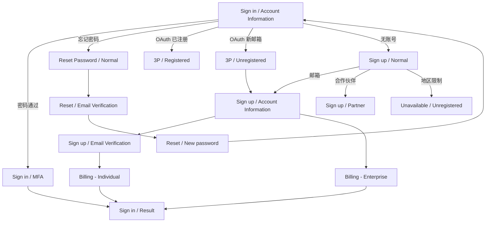

# Login — DESIGN.md

> 数据源：[Figma · Zenlayer zenConsole Login](https://www.figma.com/design/VjnKgyA71h6uJxJCSTB6NS/?node-id=532-16740) · 根节点 `532:16740` · 由 `.claude/skills/login` 生成
>
> **主题：** 仅深色模式 · **字体：** Proxima Nova · **品牌色：** `#1863ff`

---

## 1. 概览

<!-- 一段话即可。这个界面解决什么问题？谁会用？为什么存在？ -->

**适配端：** Web（默认画布 1440 × 900）
**覆盖流程：** Sign in · Sign up · Reset Password · 第三方 OAuth 衔接 · 不可用兜底
**状态总数：** 15

**布局骨架**（所有状态一致）：

```
┌──────────────────────────────────────────────────────────┐
│ TopNavigation（高 56）         Logo | Docs API EN  Sign Up│
├─────────────┬────────────────────────────────────────────┤
│             │                                            │
│  Banner     │              ┌──────────────┐              │
│ （宽 420）   │              │  Sign 卡片   │              │
│  zenConsole │              │ （宽 440）   │              │
│  hero       │              │              │              │
│             │              └──────────────┘              │
├─────────────┴────────────────────────────────────────────┤
│ CopyRight 页脚（高 48，8 个链接）                        │
└──────────────────────────────────────────────────────────┘
```

---

## 2. 设计 Tokens

<!-- 从 references/tokens.md 原样复制。按 颜色 / 间距 / 圆角 / 字体 分组。 -->

### 颜色
| Token | 值 |
|-------|----|
| `Primary/High` | `#1863ff` |
| ... | ... |

### 间距
| Token | 值 |
|-------|----|
| `Gap/S` | 4 |
| ... | ... |

### 字体
| Token | 规格 |
|-------|------|
| `Headline/H4 20_h24_B` | Proxima Nova Bold 20 / 行高 24 / 字距 0.18 |
| ... | ... |

---

## 3. 共享组件

<!-- 每个组件一行。✓ 表示该状态使用了此组件。 -->

| 组件 | nodeId | 用途 | Sign in | Sign up | Reset | 3P | Unavail |
|------|--------|------|:-:|:-:|:-:|:-:|:-:|
| `TopNavigation` | `525:17195` | Logo + Docs/API + 语言 + Sign Up CTA | ✓ | ✓ | ✓ | ✓ | ✓ |
| `Banner` | `4987:22388` | 左侧品牌面板，zenConsole hero | ✓ | ✓ | ✓ | ✓ | ✓ |
| `CopyRight` | `90:1433` | 页脚链接（Website、Terms、Privacy、Cookie、Status、Security、版权） | ✓ | — | ✓ | ✓ | ✓ |
| `ZenlayerLogo` | `90:1155` | 品牌 logo | ✓ | ✓ | ✓ | ✓ | ✓ |
| `Button` | `192:3022` | 主 / 次 / 幽灵按钮 | ✓ | ✓ | ✓ | ✓ | ✓ |
| `DropDown` | `320:4296` | 单行输入 / 下拉控件 | ✓ | ✓ | ✓ | — | — |
| `Checkbox` | `160:602` | "Remember me"、同意条款复选框 | ✓ | ✓ | — | — | — |
| `Divider` | `112:3830` | "or" 分隔线 | ✓ | ✓ | — | — | — |
| `Customer Agreement` | `450:12999` | Terms + Privacy + Cookie 内联链接 | — | ✓ | — | — | — |
| `Login/Step` | `1247:13597` | 多步骤进度指示器 | — | ✓（Billing、Partner） | — | — | — |
| `Brand/Social/*` | `192:3584` | Google · GitHub · Microsoft 按钮 | ✓ | ✓ | — | — | — |

---

## 4. 状态目录

<!-- 共 15 节，每个状态一节。使用下方模板。 -->

### 4.1 Sign in / Account Information `629:9263`

**用途：** 登录主入口 —— 邮箱 + 密码 + 社交回退。

**表单字段：**
| 字段 | 占位符 | 类型 | 必填 | 备注 |
|------|--------|------|:-:|----|
| 邮箱 | "Enter your email" | text | ✓ | 右侧邮件图标 |
| 密码 | "Enter your password" | password | ✓ | 右侧钥匙图标 |

**操作：**
- **主 CTA：** "Sign in with Email" —— 两个字段都填写前禁用（用 `Outline/Disabled` 填充）
- **次操作：** "Forgot password?" → Reset Password / Normal
- **三级：** "Don't have an account? Sign up" → Sign up / Normal
- **三级：** "Take the Leap! Be our partner" → Sign up / Partner
- **OAuth：** Google · GitHub · Microsoft（每个都通向 Third party tips）
- **持久化：** "Remember me on this device" 复选框

**标题：** "Sign in to Your Account" —— `Headline/H4 20_h24_B`

**跳转：**
- 成功 → Sign in / MFA（如开启 MFA）或 Sign in / Result
- OAuth 点击 → Third party tips / Registered 或 Unregistered

**备注：**
- 卡片宽 440，垂直居中
- 字段间堆叠间距：`Gap/L`（16px）
- 输入框圆角：`Radius/L`（此处实际渲染为 8px）

---

### 4.2 Sign in / MFA `4411:28582`

<!-- 通过 get_design_context 提取，结构与 4.1 一致 -->

---

### 4.3 Sign in / Result `4999:30514`

<!-- ... -->

---

### 4.4 Sign up / Normal `540:18337`

**用途：** 注册入口 —— 无表单字段，只有 "Sign up with Email" 主 CTA 与社交 OAuth。

**表单字段：** 无

**操作：**
- **主 CTA：** "Sign up with Email"（`Primary/High` 填充）→ Sign up / Account Information
- **OAuth：** Google · GitHub · Microsoft
- **同意条款：** Customer Agreement（内联 Terms / Privacy / Cookie 链接）

**标题：** "Welcome to Console"

**跳转：**
- 邮箱 CTA → Sign up / Account Information
- OAuth → Third party tips / Registered 或 Unregistered

**备注：**
- 此状态没有 CopyRight 页脚（提交前再核对一次）
- Customer Agreement 始终可见 —— 合规要求

---

### 4.5 Sign up / Account Information `540:18492`
### 4.6 Sign up / Email Verification `544:24171`
### 4.7 Sign up / Billing Information - Individual `629:10176`
### 4.8 Sign up / Billing Information - Enterprise `1179:11688`
### 4.9 Sign up / Partner `1247:13922`

<!-- 多步骤的 Billing/Partner 流程在卡片顶部使用 Login/Step 指示器 -->

---

### 4.10 Reset Password / Normal `639:11768`
### 4.11 Reset Password / Email Verification `639:11958`
### 4.12 Reset Password / New password `639:12129`

---

### 4.13 Third party tips / Registered `635:10836`
### 4.14 Third party tips / Unregistered `639:11571`

<!-- OAuth 返回邮箱后的衔接页 -->

---

### 4.15 Unavailable / Unregistered `7871:25354`

<!-- 注册被拦截（地区 / feature flag） -->

---

## 5. 流程图



---

## 6. 行为与可访问性

### 校验
<!-- 字段级规则：邮箱格式、密码强度、MFA 验证码长度等。从 Figma 里的提示文本提取 -->

### 错误状态
<!-- 记录 Figma 里能看到的错误样式（如输入框红边、错误提示文本）。如果 Figma 没画，标注「Figma 未提供 —— 找设计确认」 -->

### 焦点与键盘
- Tab 顺序：邮箱 → 密码 → Remember me → Forgot password → Sign in → OAuth（左→右）→ Sign up 链接
- 密码框内按 Enter 提交

### 对比度（WCAG）
| 前景 | 背景 | 比值 | 是否通过 |
|------|------|------|:-:|
| `On Surface/Font High` `#eaeef7` | `var(--zen-design-background-bg)` `#0a0a0f` | ~16.4:1 | ✓ AAA |
| `Primary/Text` `#427eff` | `#0a0a0f` | ~5.8:1 | ✓ AA |
| `On Surface/Med` `#eaeef7e0`（88% alpha） | `#0a0a0f` | ~14.4:1 | ✓ AAA |
| `On Surface/Low` `#eaeef761`（38% alpha） | `#0a0a0f` | ~6.2:1 | ✓ AA（仅大文本） |

### 待确认问题
<!-- Figma 读取过程中遇到的歧义点，需要找设计澄清 -->
- [ ] 错误状态是否已设计但隐藏？（检查 stickersheet）
- [ ] MFA 验证码字段类型 —— 单一 6 位输入框 vs 6 个独立格子？
- [ ] Sign in / MFA 校验时的 loading 态？

---

## 7. 实现建议

- 通过 token 名引用样式（如 `var(--primary-high)`），不要硬编码十六进制色值
- 字体：加载 Proxima Nova Regular（400）与 Bold（700）
- `Login/Step` 指示器只在 Billing 和 Partner 出现 —— 包成独立 slot
- 全部表单输入复用 `DropDown` 组件（`320:4296`），没有单独的 `Input` —— 拆分前先核实

---

*由 Figma 文件 `VjnKgyA71h6uJxJCSTB6NS` 生成 · 通过 `/login` skill 重新生成*
